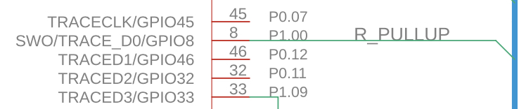
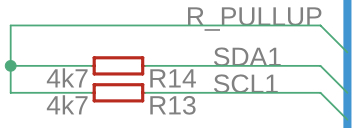

# March 19, 2022 - Give me SDO
The SWO situation almost got out of control. But first a quick recap: the nano 33 has no SWO signal included with its SWD pads. The SWO GPIO from the NINA-B306 module is being used on the nano 33 board as a pull-up for SCL & SDA I2C signals. As such, it is not externally accessible (not available on any connector or pads) and the pull-up resistors are not labeled on the PCB. So using the nRF52840's built-in SWO "debug UART" is out.

## Virtual serial port
Besides SWD SWO, the "cleanest" way to get a debug UART is through the nano 33's USB interface. After all, that's how Arduino provides a serial console. Luckily, the [SDK](https://infocenter.nordicsemi.com/index.jsp?topic=%2Fstruct_sdk%2Fstruct%2Fsdk_nrf5_latest.html) provides an example exactly for this functionality. Unfortunately, it's an absolute mess. I don't want this to turn into a rant about the nRF5 SDK, so the short of it is that it's a jumble of legacy, not legacy, hals, components, modules, drivers and "apps" scattered throughout a folder & file hierarchy that hopefully makes sense to them, but not to me. And, you would think that after reaching SDK version 17+, the [SDK the documentation](https://infocenter.nordicsemi.com/index.jsp?topic=%2Fstruct_sdk%2Fstruct%2Fsdk_nrf5_latest.html) would be expansive if not amazing... but you would be wrong. The Makefile for the "virtual serial port" example compiles 62 source files and includes 43 directories. And all it does is implement the SDK's "USB CDC (Communications Device Class) ACM (Abstract Control Model) module". Sure, I could have copied the example verbatim, but the goal of this project is to learn, not copy. On top of this, the nRF52840 is configured through a single `sdk_config.h` file that's 12k lines and basically [undocumented](https://infocenter.nordicsemi.com/index.jsp?topic=%2Fcom.nordic.infocenter.sdk5.v15.0.0%2Fsdk_config.html)! And the examples don't even include the complete file- just what's enabled for that specific example... I guess it turned into a rant after all. Ok, let's move on.

## UART
The least elegant, but easiest option is to dedicate one of the nRF52840's 2 UARTs to be a serial debug console. Luckily there were two pins on the nano 33's headers, A6 (P0.28) and A7 (P0.03), that are unused on the carrier board and the nRF52840's flexible IO interconnect allows to become UART Tx and Rx pins. Unluckily, it turns out my debugger, the ST-Link/V2, does not have a built-in SWO input and virtual serial port of its own. So out comes my trusty [FTDI 232 USB to UART](https://ftdichip.com/products/ttl-232r-3v3/) to save the day. After soldering on some headers and digging out a USB hub (3 USB ports: 1 nano 33, 1 debugger, 1 UART/USB), we finally have a working `Hello World!`. Oof... this was way more complicated than it should have been. Oh, the SDK example for using the UART peripheral is... better. Mostly because UART is simpler than the whole USB stack that the USB CDC ACM module has to take care of.

\-

Maybe choosing bare-metal over Zephyr for this project was a bad idea.

# March 13, 2022 - A slow blink
It builds! It blinks! But it doesn't talk. Yet. Ok, the good news first:
## Building for the nano 33
The nRF5 SDK is somewhat "board focused" in its BSP implementation. I guess the expectation is that development is initially taking place using one of their evaluation boards. Long story short, the makefile now includes a board definition: 
```
CFLAGS += -DCUSTOM_BOARD_INC=board
```
So that `boards.h` can correctly parse and include `board.h`, the "BSP" header for this specific board:
```C
#elif defined (CUSTOM_BOARD_INC)
  #include STRINGIFY(CUSTOM_BOARD_INC.h)
```
To be fair, it would be simpler to just edit the `boards.h` file directly and get rid of the unused compiler conditionals, but that would against the spirit of a SDK or library. I may change my mind in the future and pull relevant parts of the SDK into this codebase, but for now I would rather treat it like an included library. On one hand, it would simplify the makefile and improve the accuracy of VSCode's intellisense by removing unused files. On the other, it's nice to separate the application code from Nordic's SDK and not "adopt" the SDK source. We'll see how the project progresses and re-evaluate as it makes sense.
### Flashing
One detail to note is that I decided to keep Arduino's bootloader in the flash memory for now in case it's useful later. With 1MB of NVM I'm not worried about running out of space. The linker script `simpleye_gcc_nrf52.ld` had to be modified to skip over the first 0x10000 addresses:
```C
/* Note, flash origin changed to 0x10000 to avoid overwriting the bootloader */
MEMORY
{
  FLASH (rx) : ORIGIN = 0x10000, LENGTH = 0x100000
  RAM (rwx) :  ORIGIN = 0x20000000, LENGTH = 0x40000
}
```
## Debug serial output
The easiest way to get a serial console with ARM's SWD interface is typically by using the SWO output from the MCU. Most debuggers conveniently include a UART input for it and voila! Easy printf console debugging! Not so with the nano 33... There is no exposed SWO pad with the other SWD signals (makes sense- SWO is not needed for programming during manufacturing) and the MCU's SWO pin was repurposed to... to be a pull-up voltage for I2C resistors?

 
So that's interesting... not quite sure why the I2C resistors need a programmable pull-up, or why of available GPIOs it had to be SWO pin. That leave us with some alternative options:

1. If I2C1 is not used, then wire up the debugger's SWO input to the two resistor's "top side"
2. Repurpose another GPIO that is brought out to a board connector pin, solder the debugger to that pin and direct debug prints to that GPIO/UART
3. Configure the USB connection as a TTY device and send debug output that way

Option 3 is definitely tempting and elegant (no soldering), although I fear that resetting the MCU (like during programming) will disconnect the TTY device and require reconnecting every time, which gets annoying.


# March 11, 2022 - A slow start
The project is off to a slow start. Using an Arduino board as a "dev" board while bypassing the Arduino framework is not as straightforward as I'd initially thought. Long story below, but the TLDR is: **the nano 33 BLE needs an external debugger and soldering to its SWD programming interface in order to load and debug custom firmware.**

## The problem
Modern development and evaluation boards often interface with a PC over USB by integrating an on-board debugger. For example, the [micro:bit](https://microbit.org) implements the following [on-board debugger](https://tech.microbit.org/software/daplink-interface):

The micro:bit *INTERFACE MCU*, a Freescale Cortex-M0+, implements a variety of convenient protocols over USB for interfacing with the PC, while communicating with the *TARGET MCU* (the MCU of interest when developing) over SWD (Serial Wire Debug) and sometimes UART (the micro:bit's addition of I2C is unusual). ST similarily often includes their ST-LINK/V2 debugger/programmer on their [evaluation boards](https://www.st.com/en/evaluation-tools/32f411ediscovery.html).

This is all a somewhat poor justification for my assumption that the Arduino nano 33 BLE did something similar. It does not. There is no in-built programmer or debugger on the nano 33 board. For this board at least (unsure about other non-Cortex Arduinos) Arduino uses a bootloader to accept and apply new firmware over USB directly on the main/target MCU. There is no separate interface MCU. Once a new arduino sketch is loaded in flash, the bootloader reboots and an *Arduino OS* ([mbed OS with Arduino-specific code](https://github.com/arduino/ArduinoCore-mbed)) takes over, implements the USB serial interface and runs the user's sketch (I think). Anyway, before I go too far down the Arduino-mbed-RTOS rabbit hole, the end result is that I can't just load arbitrary firmware to the nRF52840 over the built-in USB interface. And I don't really want to deal with the bootloader and/or mbed-os. Not for this project.

## SWD to the rescue
Thankfully, Arduino had to first program the bootloader/os onto the boards before shipping, and that means there's an exposed SWD (single-wire debug) interface! [The internet](https://hackaday.io/project/168903/instructions) was quick to find said port and provide some.... information, almost a guide, for wiring it up.


The 5 SMT pads highlighted on the left are the SWD interface in the following clockwise order, starting with the top-left pad:
- Reset
- Ground
- SWCLK
- Vdd
- SWDIO

## Alternatives
For those who want to avoid soldering a separate debugger, there may be other options acceptable for your project:
### Zephyr
The [Zephyr project](https://zephyrproject.org) supports the nano 33 BLE sense and includes [documentation](https://docs.zephyrproject.org/latest/boards/arm/arduino_nano_33_ble/doc/index.html) for flashing firmware using the bootloader and USB connection. So one could either target the nano 33 with a Zephyr-based project or dig into Zephyr's source and find the [flash address range](https://github.com/zephyrproject-rtos/zephyr/blob/main/boards/arm/arduino_nano_33_ble/arduino_nano_33_ble.dts) of the bootloader.
### Arduino
Technically, all of the functional goals of this project can be accomplished entirely with the Arduino framework. There's a good [Applications of TinyML](https://www.edx.org/course/applications-of-tinyml) course on edX.org that implements various machine learning applications, including machine vision, using Arduino and Tensorflow Lite/Micro.